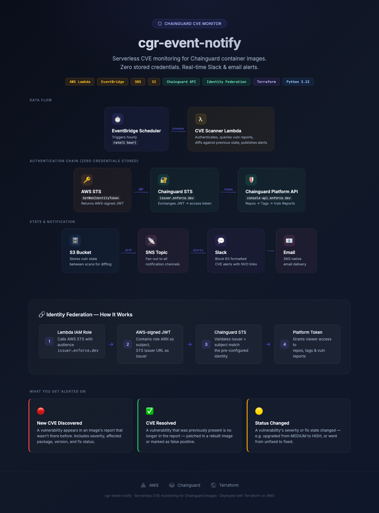

# cgr-event-notify

Monitors [Chainguard](https://www.chainguard.dev/) images for CVE changes and sends alerts to Slack and email. Uses AWS outbound identity federation to authenticate directly with the Chainguard platform APIs — no local tooling or static credentials required.

<p align="center">
  
</p>

> **Interactive version:** open [`docs/architecture.html`](docs/architecture.html) in a browser for a live, full-detail diagram.

## What You Get Alerted On

- **New CVE discovered** — a vulnerability appears in an image's vuln report that wasn't there before
- **CVE resolved** — a vulnerability that was present is no longer in the report (patched or removed)
- **CVE status changed** — a vulnerability's severity or fix state changed (e.g. went from unfixed to fixed)
- **Image-level context** — every alert tells you which image, package, and version is affected

## Prerequisites

- [Terraform](https://developer.hashicorp.com/terraform/install) >= 1.5
- [AWS CLI](https://docs.aws.amazon.com/cli/latest/userguide/getting-started-install.html) configured with appropriate credentials
- [AWS outbound identity federation](https://docs.aws.amazon.com/IAM/latest/UserGuide/id_roles_providers_outbound.html) enabled on your AWS account
- A [Chainguard](https://www.chainguard.dev/) organization with image repositories
- At least one notification channel: a [Slack incoming webhook URL](https://api.slack.com/messaging/webhooks) and/or email addresses

## Project Structure

```
cgr-event-notify/
├── terraform/
│   ├── main.tf                 # Provider configuration (AWS + Chainguard)
│   ├── variables.tf            # Input variables
│   ├── outputs.tf              # Output values
│   ├── chainguard.tf           # Chainguard identity + role binding
│   ├── lambda.tf               # Lambda functions + IAM
│   ├── sns.tf                  # SNS topic + subscriptions
│   ├── s3.tf                   # State bucket for vuln report diffs
│   ├── scheduler.tf            # EventBridge schedule
│   ├── terraform.tfvars.example
│   └── terraform.tfvars
├── lambda/
│   ├── cve_scanner/            # Authenticates, queries APIs, diffs, alerts
│   │   ├── handler.py
│   │   └── requirements.txt
│   └── slack_notifier/         # Formats and posts to Slack
│       ├── handler.py
│       └── requirements.txt
├── scripts/
│   └── package_lambdas.sh
└── README.md
```

## Setup

### 1. Retrieve your AWS STS issuer URL

Each AWS account has a unique token issuer URL for outbound identity federation. Find it in the AWS Console:

**IAM → Account settings → STS** (under the "Token issuer URL" section)

The URL will look like: `https://<uuid>.tokens.sts.global.api.aws`

### 2. Configure variables

```bash
cd terraform
cp terraform.tfvars.example terraform.tfvars
```

Edit `terraform.tfvars`:

| Variable | Required | Description |
|---|---|---|
| `chainguard_org_name` | **Yes** | Your Chainguard org name (e.g. `troylab`) |
| `aws_sts_issuer_url` | **Yes** | AWS STS token issuer URL (from step 1) |
| `watched_images` | **Yes** | List of `cgr.dev/...` image refs to monitor |
| `slack_webhook_url` | No | Slack incoming webhook URL |
| `notification_emails` | No | Email addresses for SNS alerts |
| `scan_schedule` | No | Poll frequency (default: `rate(1 hour)`) |
| `aws_region` | No | AWS region (default: `us-west-2`) |

### 3. Authenticate

**AWS:**

```bash
aws sso login --profile <your-profile>
# or
aws configure
```

Verify:

```bash
aws sts get-caller-identity
```

**Chainguard:**

The Chainguard Terraform provider authenticates via browser OAuth flow on first `terraform apply`. Make sure you have access to the organization specified in `chainguard_org_name`.

### 4. Deploy

```bash
cd terraform
terraform init
terraform plan
terraform apply
```

This creates:
- A Chainguard assumable identity bound to the Lambda's IAM role
- A role binding granting `viewer` access on your Chainguard organization
- Lambda functions, S3 bucket, SNS topic, and EventBridge schedule
- IAM policies allowing the Lambda to get web identity tokens from AWS STS

### 5. Confirm SNS subscriptions

If you added email addresses, each recipient will receive a confirmation email from AWS SNS. They must click the confirmation link to start receiving alerts.

### 6. (Optional) Run the first scan manually

The scanner runs automatically on schedule, but you can trigger it immediately:

```bash
aws lambda invoke \
  --function-name cgr-event-notify-cve-scanner \
  --payload '{"source": "manual"}' \
  /dev/stdout
```

The first run captures the current vulnerability state as a baseline (no alerts). Subsequent runs will alert on any changes from that baseline.

## How It Works

1. **EventBridge Scheduler** triggers the CVE scanner Lambda on a configurable interval.
2. The Lambda calls **AWS STS** `GetWebIdentityToken` to obtain an AWS-signed JWT with audience `https://issuer.enforce.dev`.
3. The JWT is exchanged with **Chainguard STS** (`issuer.enforce.dev/sts/exchange`) for a Chainguard platform access token, using the pre-configured assumable identity.
4. For each watched image, the Lambda calls the **Chainguard registry API** (`console-api.enforce.dev`) to:
   - Resolve the image name to a repository UIDP
   - Resolve the tag to a manifest digest
   - Fetch the full vulnerability report for that digest
5. The vulnerability state is **diffed against the previous scan** (stored in S3) to find:
   - **New CVEs**: vulnerabilities that weren't in the previous report
   - **Resolved CVEs**: vulnerabilities that were present before but are now gone
   - **Status changes**: severity or fix state changed
6. Alerts are **published to SNS**, which fans out to:
   - **Slack** via the notifier Lambda (Block Kit formatted with severity, CVE links, packages, fix info)
   - **Email** via native SNS subscriptions
7. The new vulnerability state is **saved to S3** for the next scan cycle.

## Authentication Flow

```
Lambda IAM Role
    │
    ├─ sts:GetWebIdentityToken(audience=issuer.enforce.dev)
    │   └─▶ AWS-signed JWT (sub = role ARN)
    │
    ├─ POST issuer.enforce.dev/sts/exchange
    │   └─▶ Chainguard access token
    │
    └─ GET console-api.enforce.dev/registry/v1/...
        └─▶ Vulnerability data
```

The Chainguard assumable identity is configured (via Terraform) to trust tokens from your specific AWS STS issuer URL where the subject matches the Lambda's IAM role ARN. No static secrets are stored or rotated.

## Teardown

```bash
cd terraform
terraform destroy
```

## References

- [Chainguard Assumable Identities (AWS OIDC)](https://edu.chainguard.dev/chainguard/administration/assumable-ids/identity-examples/aws-identity-oidc/)
- [AWS Outbound Identity Federation](https://docs.aws.amazon.com/IAM/latest/UserGuide/id_roles_providers_outbound.html)
- [Chainguard Terraform Provider](https://registry.terraform.io/providers/chainguard-dev/chainguard/latest)
- [Chainguard Security Advisories](https://edu.chainguard.dev/chainguard/chainguard-images/staying-secure/security-advisories/)
